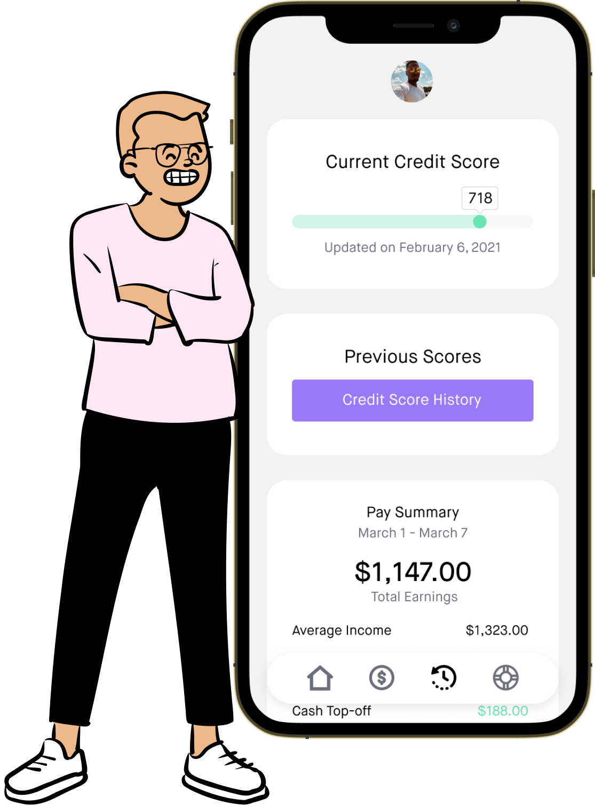

<section class="d-md-flex align-items-center justify-content-center py-5">
	

		<h1 class="display-2 pt-5 pb-3">Say goodbye to income instability</h1>
		
Extra money when your pay is low, interest-free. Intelligent savings when your pay is high. Buoy doesn’t just help you stay afloat- we help you thrive.

		<a class="btn btn-primary py-3 px-4" href="{{ site.url }}/signup">Get Started</a>
	

	

		
	

</section>

<section class="d-md-flex align-items-center justify-content-center py-5 bg-blue">
	

		<h2 class="display-4 pb-3">Buoy is built for modern workers</h2>
		
We're a new kind of financial services company using intelligent technology to make it easier than ever for gig workers, shift workers, part-timers, and even freelancers, to earn a steady living.

	

</section>

<section class="d-md-flex align-items-center justify-content-center py-5" id="features">
	

		<h2 class="display-4 pb-3">Start smoothing out your paychecks</h2>
		
Take home the same amount of money every month even when you earn less. Avoid late fees, overdraft fees, and high-interest loans.

	

	

		
	

</section>

<section class="d-md-flex align-items-center justify-content-center py-5">
	

		<h2 class="display-4 pb-3">Start building your credit score</h2>
		
Buoy helps you fix bad credit and improve your credit score to help boost your borrowing potential and lower interest rates.

	

	

		
	

</section>

<section class="d-md-flex align-items-center justify-content-center py-5">
	

		<h2 class="display-4 pb-3">Get paid on your own terms</h2>
		
We give you access to your paycheck when you want it. It's like an advance on your average salary, so we know you're good for it.

	

	

		
	

</section>

<section class="d-lg-flex align-items-center justify-content-center py-5 bg-blue">
	

		
		<h4 class="display-6 pb-2">Honest Pricing</h4>
		
Free for the first 30 days. Then just $10/month. Cancel anytime you want.

	

	

		
		<h4 class="display-6 pb-2">High Security Standards</h4>
		
Our product is encrypted end-to-end with the same technology as your bank.

	

	

		
		<h4 class="display-6 pb-2">Dedicated Support</h4>
		
Talk to a real support person whenever you need help.

	

</section>

<section class="d-md-flex align-items-center justify-content-center py-5">
	

		<h2 class="display-4 pb-3">Want to know more?</h2>
		
Buoy is brand new company, so please do some more research before you sign up.

		<a class="btn btn-primary py-3 px-4" href="{{ site.url }}/faqs">Read our FAQs</a>
	

</section>
